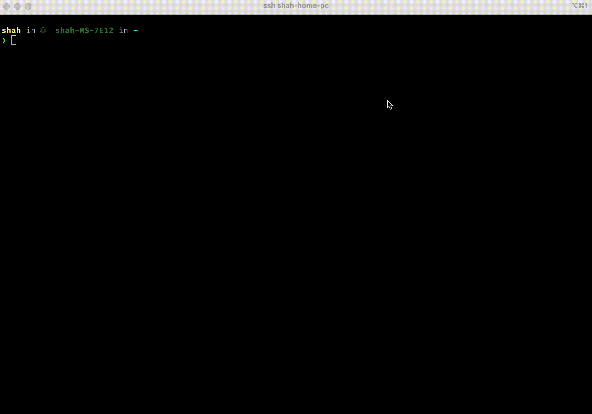

# Introduction

Have you ever dreamed of having an LLM always at hand, piping, reading, writing to it? Well dream no more! Now llm of your choice live as char device under `/dev/llm` [^1].

[^1]: This is a joke taken too seriously.

## Demo

